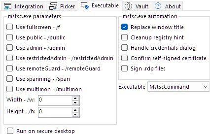
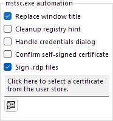
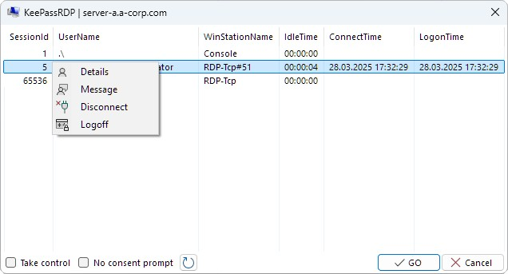
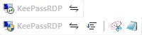

[zip]: https://github.com/iSnackyCracky/KeePassRDP/releases/latest/download/KeePassRDP_v2.3.zip
[exe]: https://github.com/iSnackyCracky/KeePassRDP/releases/latest/download/KeePassRDP_v2.3.exe
[msi]: https://github.com/iSnackyCracky/KeePassRDP/releases/latest/download/KeePassRDP_v2.3.msi

# KeePassRDP
<div align="center">

[](https://github.com/iSnackyCracky/KeePassRDP/releases/latest)
[][zip]
[][exe]
[][msi]
[](COPYING)
[](https://github.com/iSnackyCracky/KeePassRDP/releases/latest)
[](https://github.com/iSnackyCracky/KeePassRDP/releases)

</div>

## Overview
KeePassRDP is a plugin for KeePass 2.x that adds useful options to connect to the URL of an entry with RDP.

## Installation
1. <sub>[][zip]</sub> <sub>[][exe]</sub> <sub>[][msi]</sub> of the latest <sub>[](https://github.com/iSnackyCracky/KeePassRDP/releases/latest)</sub>.
2. Run the [msi setup](#silent-extraction-msi), [self-extracting exe](#silent-extraction) or unzip (and copy) the KeePassRDP.plgx file to your KeePass plugins folder.<br><small>*`(e.g. %ProgramFiles%\KeePass Password Safe 2\Plugins)`*</small>
3. Start KeePass and enjoy using KeePassRDP.

<small>

##### :zap: Also available from winget:
```bat
> winget install KeePassRDP.KeePassRDP
```

</small>

## Usage
To connect to target computers using RDP select one or multiple entries containing the IP-address(es) or hostname(s), right-click and select `KeePassRDP > Open RDP connection` *(or simply press <kbd>CTRL</kbd> + <kbd>M</kbd>)*.

<div align="center">


</div>

A [selection dialog](#selection-dialog) will be shown when multiple credentials are found. To use one of the other connection options select the corresponding item from the context menu, or press the [configurable keyboard shortcut](#keyboard-shortcuts).

## Features
- Connect to host via RDP
- Connect to host via RDP admin session <small>*(`mstsc.exe /admin` parameter)*</small>
- Support for `mstsc.exe` parameters <small>*(`/f`, `/span`, `/multimon`, `/w`, `/h`, `/public`, `/restrictedAdmin`, `/remoteGuard`)*</small>
- Select from matching (Windows or domain) credentials when target entry is inside configurable trigger group ([see below](#trigger-group--folder))
- Automatic adding and removing of credentials to and from the Windows credential manager ([how it works](#how-it-works))
- Configurable [keyboard shortcuts](#keyboard-shortcuts)
- Configurable [context menu](#context-menu--toolbar-items)
- Configurable [toolbar items](#context-menu--toolbar-items)
- Configurable [credential lifetime](#credential-lifetime)
- Customizable [credential picker](#credential-picker)
- Customizable [per entry settings](#individual-entry-settings)
- General [automatization helpers](#automatization-helpers)
- Support for [advanced settings](#advanced-settings) through .rdp files
- Support for [self-signing](#self-signing) of .rdp files
- :new: Support for [session shadowing](#session-shadowing)
- :new: Support for [secure desktop](#secure-desktop)
- Support for DPI-scaling
- Made with :heart: and :pizza:

## Languages
<sub>[](#languages)</sub> English
| <sub>[](#languages)</sub> German

See how to [translate](#translate).

<br>

## Documentation

How we use KeePassRDP on a daily basis <small>*(I work for an MSP where KeePass securely stores credentials for accessing customer domains and computers)*</small>.

### Trigger group / folder

The KeePass database could be structured like this, where each group contains entries for a specific customer:

><div align="center">
>
>
>
></div>
>

If there is only one jumphost or something similiar, we usually place a single entry including the credentials directly into the customer group:

><div align="center">
>
>
>
></div>
>

When a customer has more hosts and/or requires multiple accounts, we create a subgroup named **RDP** *(trigger group)* inside the customer group:

><div align="center">
>
>
>
></div>
>

<small>

##### The name of the trigger group can be configured from within the [KeePassRDP options form](#credential-picker) *(since v2.0)*.<br>Entries in subgroups of the "RDP" group will trigger by default, too *(since v2.3)*.

</small>

Afterwards entries for target hosts can be added to the trigger group:

><div align="center">
>
>
>
></div>
>

When using the entries matching credentials are searched from the parent *(customer)* group *(by default they will be looked up recursively within all subgroups)*:

><div align="center">
>
>
>
></div>
>

<small>

##### Ignoring entries can be toggled in the [KeePassRDP context menu](#usage) *(since v1.9.0)* or from the toolbar *(since v2.0)*.

</small>

<div id="selection-dialog"></div>

Select one or more entries in the **RDP** group, press <kbd>CTRL</kbd> + <kbd>M</kbd> and KeePassRDP will show a dialog with filtered account entries *(matching titles against a [configurable regular expression](#credential-picker-regex), e.g. domain-admin, local user, ...)* to connect to target hosts *(using credentials)*.

><div align="center">
>
>
>
></div>
>

Finally just choose the credential you want to use and click **GO** *(or press <kbd>Enter</kbd>)*.

<div id="individual-entry-settings"></div>

<small>

##### Individual entry settings can be set from the KeePassRDP tab on the edit entry form *(since v2.0)*.

</small>

><div align="center">
>
>
>
></div>
>

<div id="advanced-settings"></div>

<small>

##### Advanced settings can be configured through .rdp files *(since v2.1)*.

</small>

><div align="center">
>
>
>
></div>
>

### Keyboard shortcuts

Fully configurable from within the KeePassRDP options form.

><div align="center">
>
>
>
></div>
>

### Context menu / toolbar items

Visibility of items is configurable from within the KeePassRDP options form.

><div align="center">
>
>
>
></div>
>

### Credential picker

Customizable from within the KeePassRDP options form.

><div align="center">
>
>
>
></div>
>
>
><div id="credential-picker-regex"></div>
>
><div align="center">
>
>
>
></div>
>

### Automatization helpers

Can be activated from within the KeePassRDP options form.

><div align="center">
>
>
>
></div>
>

<div id="self-signing"></div>

A certificate for signing .rdp files can be selected or generated *(self-signed)* on the same page.

><div align="center">
>
>
>
></div>
>

### Session shadowing

KeePassRDP can be used to manage and shadow sessions on remote desktop/terminal servers.

><div align="center">
>
>
>
></div>
>

### Secure desktop

Both of [credential picker](#credential-picker) and [executable](#automatization-helpers) can be configured to run on an isolated desktop, preventing global keyboard and mouse hooks (keyloggers) from capturing the input.

<small>

##### :safety_vest: *Running the executable in a secure desktop is experimental.*

</small>

An additional toolbar is displayed when the secure desktop is in use.

><div align="center">
>
>
>
></div>
>

<small>

##### :bulb: *Clipboard content is shared throughout a window station, so it could still be read by malicious software.*

</small>

## How it works
The plugin basically calls the default `mstsc.exe` with the `/v:<address>` (and optionally other) parameter(s) to connect.

Opening a connection ***with credentials*** will save the selected credential(s) into the Windows credential manager ("vault") for access by the `mstsc.exe` process.

The credential(s) will then be removed depending on how [KeePassRDP is configured](#credential-lifetime).

When using .rdp files a temporary file is created and removed after the `mstsc.exe` process exits.

### Credential lifetime

Configurable from within the KeePassRDP options form.

><div align="center">
>
>
>
></div>
>

## Translate

You can use [Resources.de.resx](KeePassRDPResources/Resources.de.resx) as a starting point.

1. Copy and rename the file according to the language you are translating into *(e.g. KeePassRDP.**es-ES**.resx for spanish)*.
2. Translate as much as wanted.
3. Create a binary resource file from the ResX template by running the following in a VS Developer Command Prompt:

<small>

```bat
> resgen.exe KeePassRDP.es-ES.resx
```

</small>

4. Copy the generated `KeePassRDP.es-ES.resources` file to `%AppData%\KeePass`.
5. Please share your progress with the KeePassRDP community :heart:.

<small>

##### :bulb: *This also allows overwriting of all (translatable) built-in strings.*

</small>

## Silent extraction
The following example will extract the .plgx file and overwrite it in the target folder:

<small>

```bat
> KeePassRDP_v2.3.exe /Q:A /C /T:"%ProgramFiles%\KeePass Password Safe 2\Plugins"
```

</small>

<div id="silent-extraction-msi"></div>

When using the msi setup, the installation directory is determined automatically:

<small>

```bat
> KeePassRDP_v2.3.msi /qb
```
</small>

<small>

##### :bulb: *Writing into %ProgramFiles% usually requires administrator privileges. The msi setup requests elevation if necessary.*

</small>

## Building instructions
Just clone the repository:

<small>

```bash
> git clone https://github.com/iSnackyCracky/KeePassRDP.git
```

</small>

Open the solution file (KeePassRDP.sln) with Visual Studio (2022) and build the KeePassRDP project:

><div align="center">
>
>
>
></div>
>

You should get ready-to-use .plgx, .zip, and .exe files like the ones from the releases. To get an msi file build the KeePassRDPSetup project.

<small>

##### :bulb: *Remember to place a copy of KeePass.exe in the KeePass folder before building.*

</small>

## Third-party software
KeePassRDP makes use of the following third-party libraries:
- the *awesome* [**Json.NET**](https://github.com/JamesNK/Newtonsoft.Json) by James Newton-King
- the *awesome* [**PLGX Build Tasks**](https://github.com/walterpg/plgx-build-tasks) by Walter Goodwin
- the *awesome* [**WixSharp**](https://github.com/oleg-shilo/wixsharp) by Oleg Shilo
- [**Visual Studio 2022 Image Library**](https://www.microsoft.com/en-us/download/details.aspx?id=35825) by Microsoft